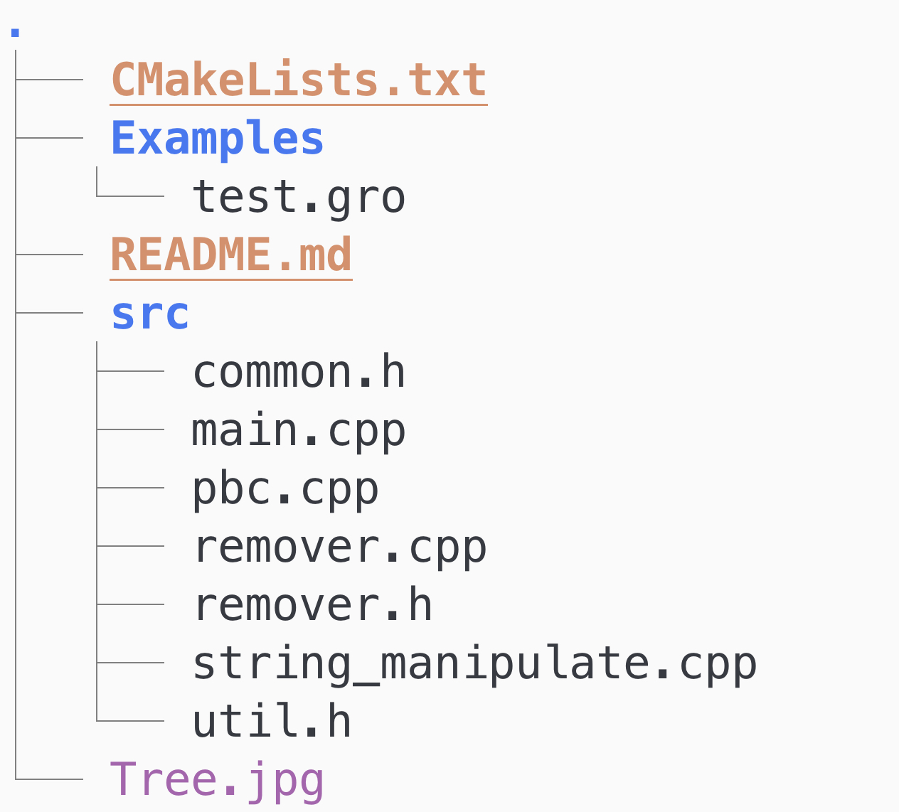

### OverLapRemover 
--- 

A C++ toolkit to remove overlapped molecules with a target molecule. 
This toolkit comes handy, when we try to create initial configuration for 
molecular simulation. We might want to insert a target molecule into the box and
remove any overlaps it has.

### Code Organization
---
 

&nbsp;
&nbsp;

### Installation
---

```bash 
git clone https://github.com/masrul/OverLapRemover
cd OverLapRemover 
mkdir build && cd build 
cmake .. -DCMAKE_INSTALL_PREFIX=/path-to-bin/ 
make && make install 
```

### Usages
--- 

```bash 
overlap_remover \
    -i [input.gro] \
    -o [out.gro] \
    -rcut [cut-off distance for overlap]\
    -target [ID of target molecule] 
```

An example *.gro file is located at Example/test.gro 
```bash 
overlap_remover -i test.gro  -o clean.gro -rcut 0.35 -target 15101
```

### Copyright 
Masrul Huda (c) 2021
